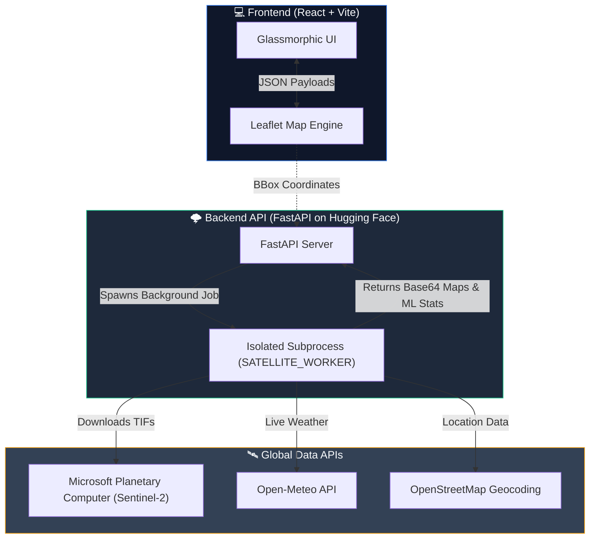

# 🌍 SmartAgro

**An Autonomous, Multi-Spectral Satellite Intelligence Engine for Precision Agriculture**

    

SmartAgro bridges the gap between complex aerospace data and actionable farming intelligence. Using **live Sentinel-2 satellite imagery**, unsupervised machine learning, and hyper-local environmental APIs, SmartAgro acts as an "eye in the sky." It instantly analyzes massive tracts of land, detecting microscopic stress before it becomes visible, and autonomously calculating the exact resources needed for recovery.

---

## 🌐 Live Environments

| Resource | Link |
| :--- | :--- |
| **💻 Web Dashboard (Vercel)** | [https://smart-agro-eight.vercel.app](https://smart-agro-eight.vercel.app) |
| **⚙️ Backend API (Hugging Face)** | [https://harsh0o23-smart-agro-api.hf.space](https://harsh0o23-smart-agro-api.hf.space) |
| **📁 Source Code** | [GitHub Repository](https://github.com/Harshkumar2306/SmartAgro) |

---

## ✨ Key Features

### 🛰️ Live Multi-Spectral Remote Sensing
Connects directly to the **Microsoft Planetary Computer** to fetch raw aerospace data.
*   **Intelligent Mosaicking:** Automatically detects if a selected farm crosses the boundary between two satellite capture zones (tiles). It dynamically fetches adjacent tiles taken on the exact same day and seamlessly stitches (`np.maximum`) them together, ensuring zero data loss or black boundaries.

### 🧠 Unsupervised ML Stress Detection
Traditional apps use arbitrary thresholds. SmartAgro feeds raw satellite indices (NDVI) into a **K-Means Clustering Algorithm** (`scikit-learn`). 
*   The AI autonomously teaches itself how to group millions of pixels into three distinct clusters: **Healthy** (High Vigor), **Moderate** (Struggling), and **Stressed** (Bare soil or drought).

### 🚛 Actionable Resource Optimizer
Moves beyond generic metrics to provide deep agronomic value.
*   **Nitrogen Calculation:** Evaluates the exact hectare size of the "Stressed" zones and estimates the Metric Tons of fertilizer (e.g., Urea) required for recovery.
*   **Water Deficit:** Reads the satellite NDWI (Normalized Difference Water Index). If drought is detected, it calculates the exact volume of water (in cubic meters) required to restore the canopy.

### ⛈️ Predictive Disease Risk Radar
Moves the platform from *reactive* to *proactive*. 
*   Cross-references live humidity and temperature (from **Open-Meteo**) with the canopy moisture index. It automatically triggers "Critical Risk" warnings for fungal and pathogen outbreaks when hot, highly humid conditions align.

---

## 🏗️ System Architecture

SmartAgro operates on a decoupled architecture designed to handle extremely heavy raster matrix math without crashing.



---

## 🛠️ Local Setup & Testing

### Prerequisites
*   Node.js (18+)
*   Python (3.9+)

### 1. Run the Frontend
```bash
cd frontend
npm install
npm run dev
```

### 2. Run the Backend
```bash
cd backend
python -m venv venv
source venv/bin/activate  # On Windows: venv\Scripts\activate
pip install -r requirements.txt
python server.py
```
*(Note: Ensure you have GDAL installed on your system if running locally. Alternatively, rely on the Hugging Face Docker deployment).*

---

## 🧪 Core API Endpoints

| Method | Endpoint | Description |
| :--- | :--- | :--- |
| `POST` | `/api/analyze-async` | Submits bounding box coordinates. Spawns an isolated subprocess to download satellite data, run ML clustering, and returns a `job_id`. |
| `GET` | `/api/status/{job_id}` | Long-polling endpoint that returns the finished JSON payload containing base64 raster maps, resource needs, and disease risks. |
| `GET` | `/api/weather` | Fetches live hyper-local meteorological data via Open-Meteo. |

---

## ⚖️ Evaluation & Quality Criteria

| Engineering Pillar | Execution Strategy |
| :--- | :--- |
| **Distributed Systems Logic** | Overcame C-level `rasterio` segfaults by inventing an asynchronous Subprocess Worker architecture to completely isolate heavy ML math from the API event loop. |
| **Geospatial Mastery** | Implemented on-the-fly multi-tile mosaicking to solve the classic "Edge-of-Scene" boundary cutoffs in satellite STAC queries. |
| **UX & Polish** | Pixel-perfect glassmorphism, fluid micro-animations, and dynamic data visualization (Recharts) built entirely for commercial enterprise feel. |
| **Cloud-Native Deployment** | Frontend edge-network delivery via Vercel tied directly to a highly-available Hugging Face Docker container. |

<p align="center">Built with ❤️ for a world that needs smarter agriculture.</p>
