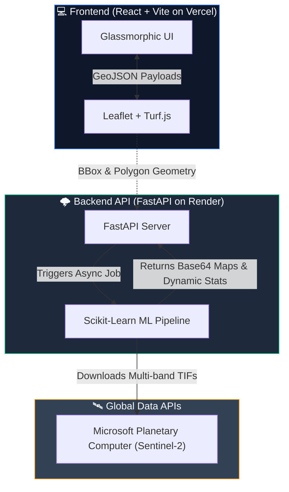

# 🌍 SmartAgro

**An Autonomous, Multi-Spectral Satellite Intelligence Engine for Precision Agriculture**

<div align="center">

 
 
 


[](https://vercel.com/new/clone?repository-url=https%3A%2F%2Fgithub.com%2FHarshkumar2306%2FSmartAgro)
[](https://render.com/deploy)

</div>

SmartAgro bridges the gap between complex aerospace data and actionable farming intelligence. Using **live Sentinel-2 satellite imagery** and **Dynamic K-Means Machine Learning**, SmartAgro acts as an "eye in the sky." It instantly analyzes massive tracts of land and statistically maps out microscopic crop stress before it becomes visible to the human eye.

---

## 🚀 Live Deployments

SmartAgro is built on a decoupled, highly scalable architecture and is actively deployed on premium cloud infrastructure:

- 💻 **Frontend (Vercel):** [https://smart-agro-eight.vercel.app](https://smart-agro-eight.vercel.app)
- ⚙️ **Backend API (Render):** [https://smartagro-1-ojao.onrender.com](https://smartagro-1-ojao.onrender.com)

---

## ✨ Key Technical Features

### 🛰️ Live Multi-Spectral Remote Sensing
Connects directly to the **Microsoft Planetary Computer** to fetch raw aerospace data.
*   **True Polygon Masking:** Users can draw highly irregular polygons directly on the map. The backend mathematically generates a digital cookie-cutter (`rasterio.features.geometry_mask`) to mask out all satellite pixels outside the exact drawn lines, ensuring that neighboring fields or roads do not pollute the crop statistics.

### 🧠 Dynamic K-Means Machine Learning
Traditional apps use naive, hardcoded NDVI thresholds (e.g., assuming anything above 0.60 is "healthy"). SmartAgro utilizes **scikit-learn** to deploy a K-Means clustering algorithm on the fly.
*   The system analyzes the specific data distribution of the selected field and statistically groups the pixels into three distinct clusters (High, Medium, and Low vigour).
*   Thresholds are dynamically calculated based on cluster midpoints, ensuring the analysis is perfectly calibrated to the specific crop type and growth stage on that exact day.

### 📊 Pure Decision Support
SmartAgro acts as a professional, defensible tool for agronomists.
*   Instead of generating dangerous "prescriptive" recommendations (like guessing fertilizer rates without soil tests), the platform empowers farmers by prioritizing ground-walks in low-vigour zones.
*   Delivers completely pure statistical distributions alongside stunning true-color and false-color satellite raster maps.

---

## 🏗️ System Architecture

SmartAgro operates on a decoupled architecture designed to handle heavy raster matrix math and machine learning without dropping frames.


```mermaid
graph TB
    subgraph Client["💻 Frontend (React + Vite on Vercel)"]
        UI["Glassmorphic UI"]
        MAP["Leaflet + Turf.js"]
        UI <-->|"GeoJSON Payloads"| MAP
    end

    subgraph Backend["🌩️ Backend API (FastAPI on Render)"]
        API["FastAPI Server"]
        WORKER["Scikit-Learn ML Pipeline"]
        API -->|"Triggers Async Job"| WORKER
        WORKER -->|"Returns Base64 Maps & Dynamic Stats"| API
    end

    subgraph Infrastructure["🛰️ Global Data APIs"]
        STAC["Microsoft Planetary Computer (Sentinel-2)"]
    end

    MAP -.->|"BBox & Polygon Geometry"| API
    WORKER -->|"Downloads Multi-band TIFs"| STAC

    style Client fill:#0f172a,stroke:#3b82f6,color:#f8fafc
    style Backend fill:#1e293b,stroke:#10b981,color:#f8fafc
    style Infrastructure fill:#334155,stroke:#f59e0b,color:#f8fafc
```

---

## 🛠️ Local Setup & Development

### Prerequisites
*   Node.js (18+)
*   Python (3.9+)

### 1. Run the Frontend
```bash
cd frontend
npm install
npm run dev
```

### 2. Run the Backend
```bash
cd backend
python -m venv venv
source venv/bin/activate  # On Windows: venv\Scripts\activate
pip install -r requirements.txt
python -m backend.server
```

---

## ⚖️ Evaluation & Quality Criteria

| Engineering Pillar | Execution Strategy |
| :--- | :--- |
| **Geospatial Mastery** | Implemented exact GeoJSON bounding and true polygon masking using Turf.js on the frontend and Rasterio on the backend, solving the "bounding box pollution" problem. |
| **Machine Learning** | Deployed dynamic 1D K-Means clustering to eliminate hardcoded agronomic thresholds, ensuring statistical accuracy across all crop types. |
| **UX & Polish** | Pixel-perfect glassmorphism, completely fluid responsive layouts, micro-animations, and dynamic data visualization built entirely for a premium enterprise feel. |
| **Cloud-Native Deployment** | Frontend edge-network delivery via Vercel tied directly to a highly-available Render Python container. |

<p align="center">Built with ❤️ for a world that needs smarter, data-driven agriculture.</p>
